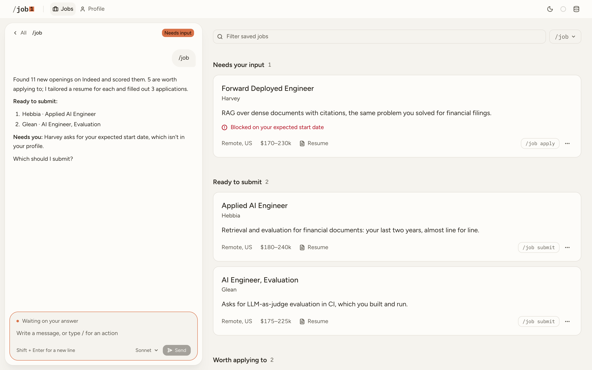

<p align="center">
  <picture>
    <source media="(prefers-color-scheme: dark)" srcset="assets/wordmark-dark.svg">
    
  </picture>
</p>

## Watch the walkthrough

New to /job? This video walks through installing it, setting it up, and your first run.

<a href="https://youtu.be/vcAzFuTEs1s">
  
</a>

## Before you start

Make sure you have the following:

- **Claude Code**. If you don't have it yet, follow
  [Anthropic's guide](https://code.claude.com/docs/en/quickstart#step-1-install-claude-code).
- **Google Chrome** or **Microsoft Edge**.
- **(Recommended) Your resume or LinkedIn profile.** Setup is 2x faster if you have something for the skill to work from.

## Install & Setup (10-15 minutes)

1. **Open Claude Code**, wherever you use it.
2. **Copy this line, paste it into Claude Code, and press <kbd>Enter</kbd>:**

   ```
   Install /job: clone https://github.com/slashjob/job.git into ~/.claude/skills/job, then follow ~/.claude/skills/job/references/install.md
   ```

3. **Do what Claude tells you.** It will walk you through everything. If you stop partway, type
   `/job setup` later to pick up where you left off.

## Commands

Type any of these into Claude Code and press <kbd>Enter</kbd>:

| Type                       | To                                                                                                       |
| -------------------------- | -------------------------------------------------------------------------------------------------------- |
| `/job`                     | find jobs, write resumes, and fill in applications, left open in the browser for you to check and submit |
| `/job search`              | only find jobs                                                                                           |
| `/job resume`              | only write resumes                                                                                       |
| `/job apply`               | only fill in applications                                                                                |
| `/job dashboard`           | open the dashboard                                                                                       |
| `/job install`             | update to the latest version                                                                             |
| `/job help`                | list every command                                                                                       |

## The dashboard

The dashboard is a more convenient way to interface with `/job`. To run it, type `/job dashboard` in Claude Code and it opens the dashboard in your browser.

<picture>
  <source media="(prefers-color-scheme: dark)" srcset="assets/dashboard-jobs-dark.png">
  
</picture>

## When something's off

- **Something broken?** Please
[open an issue on GitHub](https://github.com/slashjob/job/issues/new) and say what happened. I see
every one, and the sooner I hear about a problem, the sooner I can fix it for you.
- **Want something changed?** Tell Claude in plain words, e.g. "too many senior roles" or "the summary oversells my Postgres work". It changes your profile, search instructions or resume writing to match.

## Your data

Everything stays on your computer.

## Disclaimer

`/job` runs on your computer. It isn't an online service. You're responsible for the applications
you submit and for following the rules of the sites it uses.

## License

For your personal use only. See [LICENSE](LICENSE).
