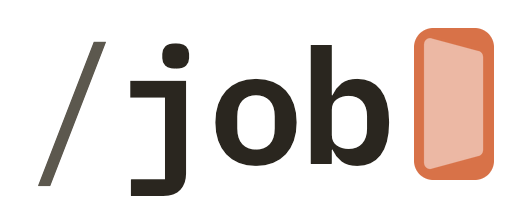
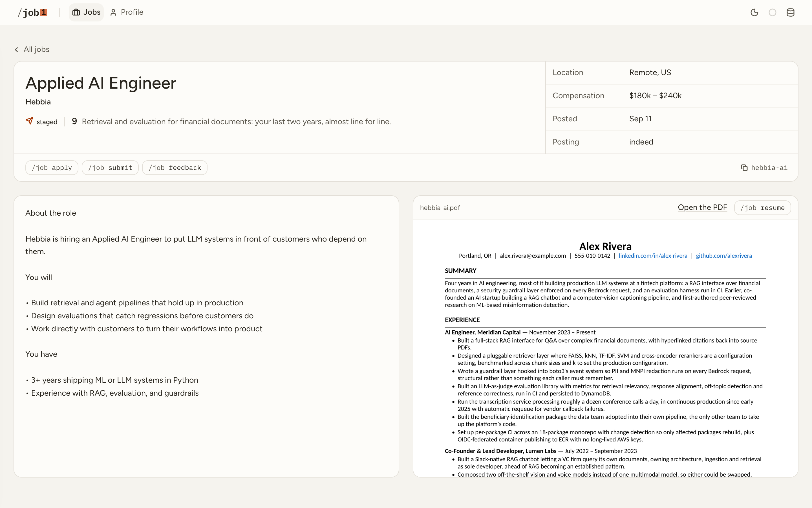
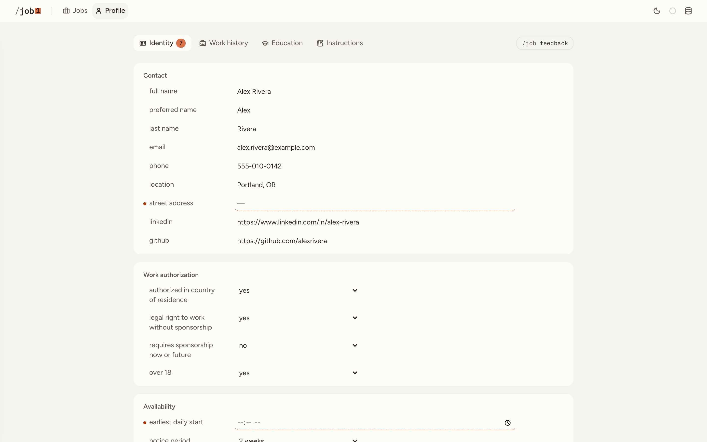

<p align="center">
  <picture>
    <source media="(prefers-color-scheme: dark)" srcset="docs/logo-dark.png">
    
  </picture>
</p>

<p align="center"><strong>The job skill, in your browser</strong></p>

<p align="center">
  <a href="https://github.com/slashjob/job"></a>
</p>

An app that runs in your browser, on your own computer, for the [`job`](..) skill. It does everything the skill does, without typing a command: find jobs, write a
resume for each one, and fill in the applications.

<picture>
  <source media="(prefers-color-scheme: dark)" srcset="docs/runs-dark.png">
  
</picture>

## What you get

- **No commands.** Each job has a button for its next step.
- **Jobs that need you come first.** Each job shows why it was ranked where it was, next to the resume
  written for it.

  <picture>
    <source media="(prefers-color-scheme: dark)" srcset="docs/job-dark.png">
    
  </picture>

- **Edit your profile directly.** It shows which application questions you haven't answered yet,
  before they hold up an application.

  <picture>
    <source media="(prefers-color-scheme: dark)" srcset="docs/profile-dark.png">
    
  </picture>

- **Answer questions on the page.** When a run needs something from you, it asks at the bottom of
  the page and waits.
- **Runs on your computer.** No account needed. It uses the same data as the skill.

## Getting started

You'll need the [`job` skill](../README.md#install).

1. **Install the dashboard:**

   ```
   cd ~/.claude/skills/job/dashboard && npm install
   ```

2. **Start it** with `npm run dev`, and open http://127.0.0.1:8765. The first time, it points you to
   setup, which builds your profile from your resume, LinkedIn, or GitHub, personal website, or any other source you choose.

   To open it from another device, start it with `npm run dev:web` instead. It prints a
   `https://<username>-job-skill-dashboard.loca.lt` address and the password the page asks for.
   Anyone with both can start runs on this machine, so stop it when you're done.

## Questions

**Can I still use the skill in the terminal?**
Yes. The dashboard reads and writes the same database as the skill, so a job found in the terminal
shows up in the dashboard, and the other way around.

**Does a run stop if I close the tab?**
No. Runs keep going while `npm run dev` is running. Stopping the dashboard stops them.

**Will Claude ask before it does something during a run?**
No. Runs start with Claude Code's permission prompts turned off, so they can work without you. The
skill still never submits an application. That stays with you.

**Can I pick the model?**
Yes. Choose Opus, Sonnet, or Haiku from the dashboard. Sonnet is the default.

**Can I see how much of my Claude plan I've used?**
Yes. Set the dashboard's `statusline.sh` as Claude Code's status line in `~/.claude/settings.json`:

```json
"statusLine": { "type": "command", "command": "~/.claude/skills/job/dashboard/statusline.sh" }
```

## Disclaimer

The dashboard runs on your computer. It isn't an online service. You're responsible for the applications
you submit and for following the rules of the sites it uses.

## License

Free and open source under the [MIT License](../LICENSE).
